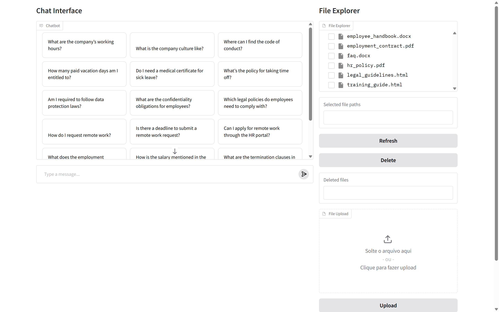

# 🧠 Corporate Document Assistant with RAG

This project is a corporate document assistant that uses Retrieval-Augmented Generation (RAG) and OpenAI's LLMs to answer questions based on internal documents. It supports interactive chat and document uploads via a web interface built with Gradio.

---

## ✅ Features

- Upload and manage `.pdf`, `.docx`, and `.html` documents
- Automatic text extraction and chunking
- Embedding with OpenAI's `text-embedding-ada-002`
- Vector search using FAISS
- Conversational interface powered by GPT-4o-mini
- Web interface with tabs for chat and file explorer

---

## 📂 Folder Structure

```
.
├── assets/                   # App assets (images, etc.)
│   └── interface-preview.png
├── docker-compose.yml        # Docker Compose config
├── Dockerfile                # Docker build file
├── main.py                   # Main application script
├── rag_pipeline/             # RAG pipeline code
│   ├── pipeline.py
│   └── __pycache__/
├── utils/                    # Utility functions
│   ├── file_utils.py
│   └── __pycache__/
├── uploads/                  # Uploaded documents (user files)
├── tmp/                      # Temporary files
├── requirements.txt          # Python dependencies
├── README.md                 # This file
├── chat_examples.txt         # Example chat prompts
└── knowledge-base/           # (Legacy/unused) document storage
```
---

## ⚙️ Requirements

- Python 3.10+
- OpenAI API key

Install dependencies:
```bash
pip install -r requirements.txt
```

---

## 🔐 Environment Variables

Create a `.env` file in the root directory based on `.env.example`:

```
OPENAI_API_KEY=your-openai-api-key-here
```

---

## 🚀 How to Run

### Local
```bash
conda create --name venv python=3.11
conda activate venv
pip install -r requirements.txt
python main.py
```

### Docker
```bash
docker compose up --build
```

This will open the app in your default web browser with two tabs:

1. **Chat** — Ask questions based on uploaded documents
2. **File Explorer** — Upload or browse the document base

---


## 🖼️ Interface Preview

- Upload documents using the file upload area on the main page
- Ask questions directly in the chat area, such as:
  - “What is the vacation policy?”
  - “What is the deadline for reimbursement?”
  - “What are the promotion criteria?”
  - “What happens if I delay a financial report?”



---

## ❓ Example Questions

You can test your RAG system with questions like:

### 🧭 Employee Handbook
- What are the company’s working hours?
- What is the company culture like?
- Where can I find the code of conduct?

### 🧑‍💼 HR Policy
- How many paid vacation days am I entitled to?
- Do I need a medical certificate for sick leave?
- What’s the policy for taking time off?

### ⚖️ Legal Guidelines
- Am I required to follow data protection laws?
- What are the confidentiality obligations for employees?
- Which legal policies do employees need to comply with?

### ❓ FAQs
- How do I request remote work?
- Is there a deadline to submit a remote work request?
- Can I apply for remote work through the HR portal?

### 📝 Employment Contract
- What does the employment agreement include?
- How is the salary mentioned in the contract?
- What are the termination clauses in the agreement?

### 📚 Training Guide
- How do I complete the onboarding training?
- Where do I access the LMS platform?
- How many modules are required in the training?

---

## 📥 Supported File Types

- `.pdf`
- `.docx`
- `.html`

Files are stored in the `./knowledge-base/` directory and automatically parsed and indexed into FAISS.

---

## 🧠 How It Works

1. **Load Documents**: All files from `knowledge-base/` are parsed.
2. **Chunking**: Text is split into 1000-character chunks with 200-character overlap.
3. **Embedding**: Chunks are converted into vectors using OpenAI embeddings.
4. **Vector Store**: FAISS stores the vector index locally.
5. **Conversation**: User messages are processed by a ConversationalRetrievalChain using GPT-4o-mini and retrieved chunks.

---

## 📊 Improvements & Next Steps

- Enable dynamic reindexing after new file upload
- Display source citations in chat replies
- Add user feedback collection (👍 / 👎)
- Switch to Pinecone for scalable cloud vector search
- Add authentication and role-based access

---

## 📝 License

This project is for internal/prototype use and is not licensed for commercial deployment.

---

## 🙌 Acknowledgements

- [LangChain](https://www.langchain.com/)
- [FAISS](https://github.com/facebookresearch/faiss)
- [Gradio](https://www.gradio.app/)
- [OpenAI](https://platform.openai.com/)